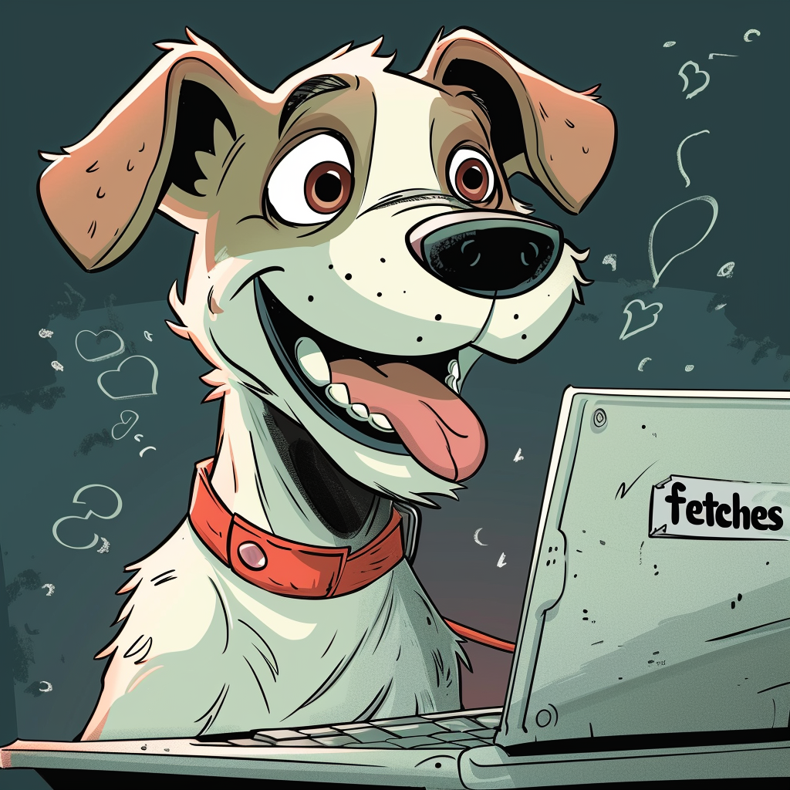

<!--  -->

MUT: Malicious and advertising URL Training pipelines and frameworks

MUT is a series of processing pipelines and frameworks for ingesting URLs, extracting features, and performing classification.